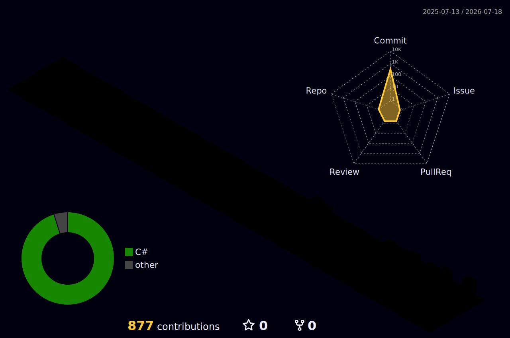

# Hi there, I'm Q1-Build.

> "Eat. Code. Build Games. Repeat."

<br>

### 🛠️ Core Stack & Infrastructure

```cpp
struct GameDeveloper
{
    const char* engines[]   = { "Unity" };
    const char* languages[] = { "C#", "C" };
    const char* pipeline[]  = { "Git", "GitHub", "Notion" };
    const char* ai_agents[] = { "OpenAI Codex", "Claude Sonnet" };
};
```

[](https://github.com/sponsors/Cryo-Node)



