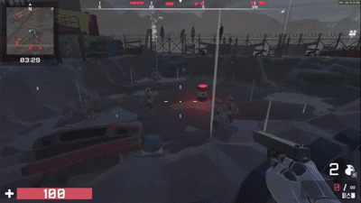

# Hi there, I'm Q1-Build.

> "Eat. Code. Build Games. Repeat."

Unity game developer focused on building maintainable gameplay systems, reusable architecture, and steadily improving through hands-on projects.

<br>

## 🚀 Recent Project

### Z_Defense

<p align="center">
  
</p>

An isometric zombie-apocalypse idle turret-defense mobile game developed as a team project.

- Designed and developed the turret systems that drive the core gameplay loop.
- Contributed to audio, map design, optimization, and item planning.

`Unity` · `C#` · `Mobile` · `Isometric` · `Idle Defense` · `Turret Defense`

[View Repository](https://github.com/kyungil-meta12/CT02-Project_Z_Defense)

<br>

## 🛠️ Core Stack & Tools

```csharp
public static class DeveloperToolkit
{
    public const string Engine = "Unity 6";
    public const string Language = "C#";
    public const string IDE = "JetBrains Rider";
    public const string VersionControl = "Git & GitHub";
    public const string Documentation = "Notion";
}
```

<br>

## 🎮 Featured Projects

Projects are displayed from newest to oldest, while project numbers follow the order in which they were created.

### 05. Z_Defense

<p align="center">
  
</p>
<p align="center">
  <a href="https://youtube.com/shorts/PVTNwk-k4xc?feature=share">
    
  </a>
</p>

An isometric zombie-apocalypse idle turret-defense game designed for mobile platforms.

**Project Type**  
Team project

**Genre**  
Isometric · Zombie Apocalypse · Idle Game · Turret Defense

**Role & Contributions**

- Planned and developed the turret systems that drive the main gameplay loop.
- Handled turret-related audio planning and implementation.
- Designed the game map and overall combat-space layout.
- Worked on performance optimization for the game environment and gameplay systems.
- Planned item concepts and their role within the game loop.

**Repository**  
[kyungil-meta12/CT02-Project_Z_Defense](https://github.com/kyungil-meta12/CT02-Project_Z_Defense)

---

### 04. Act Normal

<p align="center">
  
</p>
<p align="center">
  <a href="https://youtu.be/0gU7_gaKVCU">
    
  </a>
</p>

A social-deduction game and my first project featuring networked multiplayer functionality.

**Project Type**  
Team project

**Genre**  
Multiplayer · Social Deduction · NPC Disguise · Hide and Seek

**Role & Contributions**

- Planned and developed the project's main gameplay content and core player experience.
- Worked on the NPC-disguise and mission-based gameplay concepts that define the project.
- Contributed to the visual art direction and production of selected art assets.
- Designed and implemented parts of the user interface.

**Repository**  
`Private Team Repository`

---

### 03. MOOD

<p align="center">
  
</p>
<p align="center">
  <a href="https://youtu.be/_kkI0JHAeRY">
    
  </a>
</p>

A first-person FPS inspired by Doom and my first Unity 3D game project.

**Project Type**  
Team project

**Genre**  
3D · First-Person Shooter · Action

**Role & Contributions**

- Designed the level layout and encounter spaces.
- Created camera direction and presentation for gameplay moments.

**Technical Highlights**

- Developed the enemy spawn system used to control combat encounters.
- Configured NavMesh-based navigation for enemy movement.

**Repository**  
`Private Team Repository`

---

### 02. CrystalCore

<p align="center">
  
</p>
<p align="center">
  <a href="https://youtu.be/Z403AX2haBE">
    
  </a>
</p>

My first personal Unity project, created as a Vampire Survivors-style game recreation.

**Project Type**  
Solo personal project

**Genre**  
2D · Survival Action · Roguelite

**Role & Key Learning**

- Designed and implemented the full project independently.
- Established a basic foundation for organizing gameplay systems and project architecture.

**Technical Highlights**

- Structured gameplay data with ScriptableObjects.
- Implemented object pooling as an introductory optimization technique.

**Repository**  
`Private Repository`

---

### 01. Reversi CLI Game

<p align="center">
  
</p>

My first coded game: a command-line board game inspired by Reversi/Othello.

_Refactored once after the initial implementation._

**Project Type**  
Solo learning project

**Genre**  
CLI · Turn-Based · Board Game

**Role & Key Learning**

- Built a complete turn-based game loop without a game engine.
- Learned foundational control flow, state management, and debugging through a complete game project.

**Technical Highlights**

- Represented the board state and processed player input through the console.
- Implemented legal-move validation and captured-piece checks across multiple directions.

**Repository**  
[Q1-Build/002-CLIGame-REVERSI](https://github.com/Q1-Build/002-CLIGame-REVERSI)

<br>

## 🧩 Engineering Approach

- **Maintainability first** — Keep responsibilities clear and systems understandable as projects grow.
- **Data-driven gameplay** — Separate gameplay values from runtime behavior using ScriptableObjects where appropriate.
- **Low coupling** — Prefer events and focused interfaces when they reduce unnecessary dependencies.
- **Reusable systems** — Extend gameplay components without rewriting stable behavior where practical.
- **Incremental architecture** — Start with the simplest viable structure and refactor when actual requirements justify it.

<br>

## 📈 Development Activity


<br>

## 🔗 Explore & Support

<p align="left">
  <a href="https://github.com/Q1-Build?tab=repositories">
    
  </a>
  <a href="https://github.com/sponsors/Q1-Build">
    
  </a>
</p>
