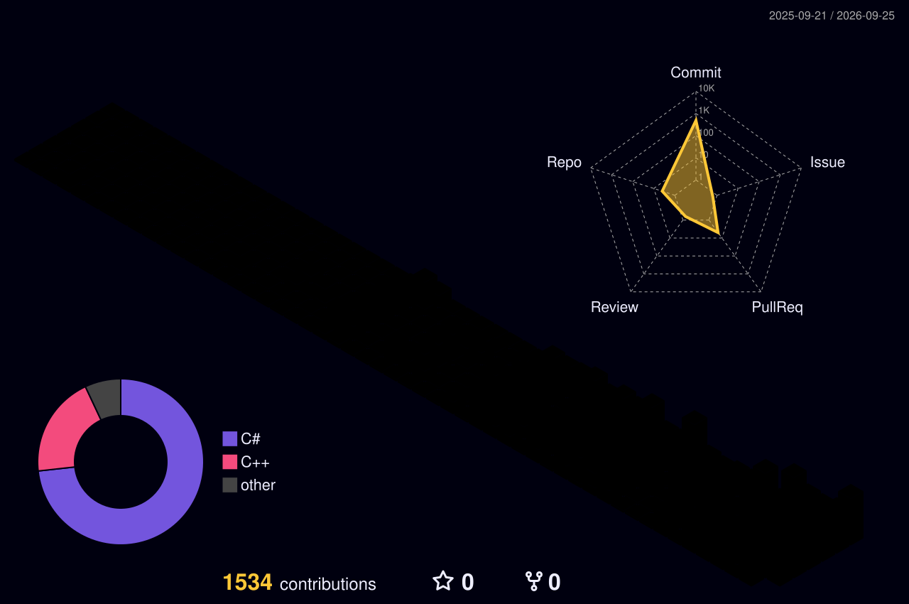

# Hi there, I'm Q1-Build.

> "Eat. Code. Build Games. Repeat."

<br>

### 🛠️ Core Stack & Infrastructure

```cpp
struct GameDeveloper
{
    Engine      = Unity6;

    Language    = C#;

    Architecture =
    {
        EventBus,
        ObjectPooling,
        ScriptableObject,
        StateMachine,
        DependencyInjection
    };

    Tools =
    {
        Rider,
        Git,
        GitHub,
        Notion
    };

    AI =
    {
        Codex,
        Claude
    };
};
```

[](https://github.com/sponsors/Q1-Build)



